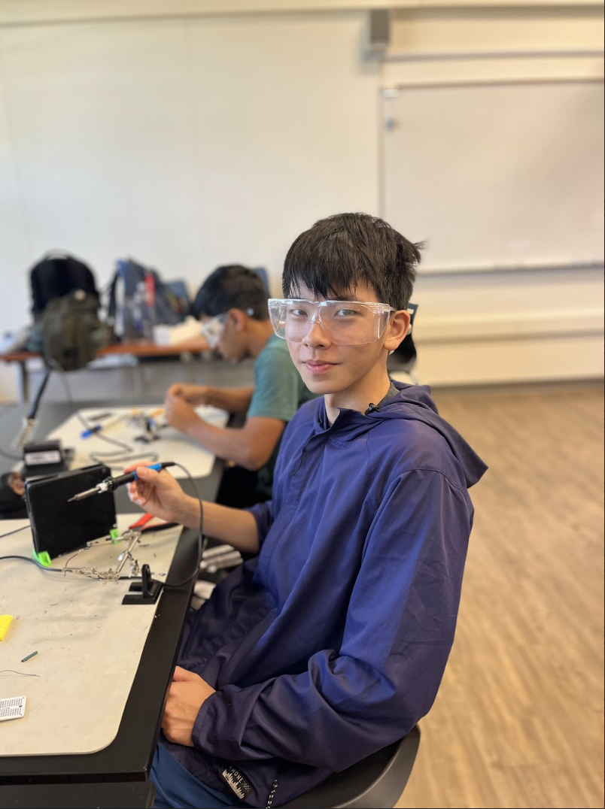
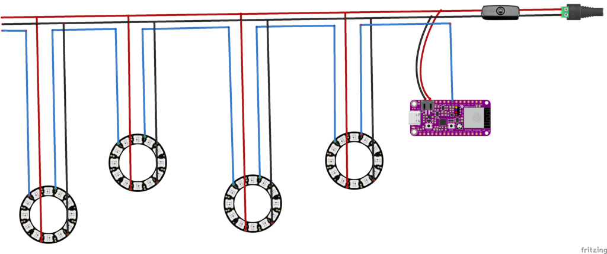
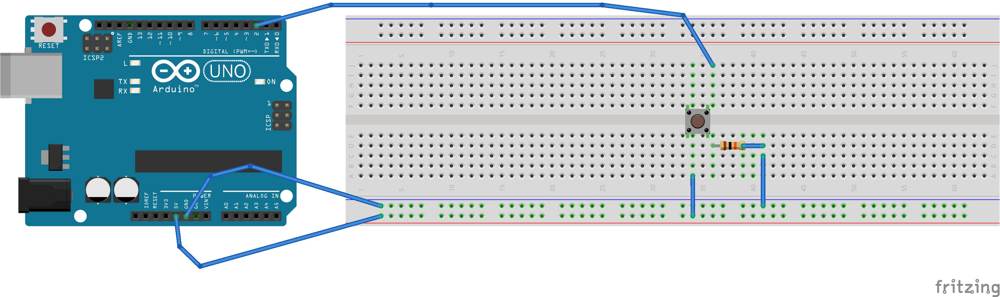

| **Engineer** | **School** | **Area of Interest** | **Grade** |
|:--:|:--:|:--:|:--:|
| Ryerson | Saint Andrews School (Delaware) | Material  | 10th grade

# First Milestone

I chose the sound-reactive paper lantern to be my main project. This project functions on LED rings which are placed in the lanterns. The LED lights receive information from the microcontroller that was passed from the computer. They react to sound through a microphone on the computer, which is transcribed by the software. I planned to first assemble a prototype (Which is the first milestone). This prototype consists of simply a power supply, a switch, a microcontroller, and an LED ring. The power, when the switch is pressed, would pass onto the microcontroller and the LED ring at the same time, powering both. The commands would be sent from the software on the computer, which is received by the controller. The data is then transmitted through the data input wire to the LED ring, which controls the lighting pattern of the LED ring.
I have so far succeeded in applying the software, soldering three wires together, using a screw terminal, and connecting LEDs to the microcontroller.
One challenge faced was the complicated schematic, which I hope will be solved in the future by drawing a more detailed schematic map. Also, this project requires precise soldering in many spots, which I am excited to learn more about and do better on. 
My next step is to desolder my prototype and move on to create a schematic with 7-8 LED rings wired, and make all of them reactive to music. 

<iframe width="560" height="315" src="https://www.youtube.com/embed/NpqBCa7kghs?si=nl133czFQXI5RgUp" title="YouTube video player" frameborder="0" allow="accelerometer; autoplay; clipboard-write; encrypted-media; gyroscope; picture-in-picture; web-share" referrerpolicy="strict-origin-when-cross-origin" allowfullscreen></iframe>

# Second Milestone
The second milestone of my project includes finishing building the structures of the lanterns (For instance, using expanders to expand the lanterns) and connecting all the wires. Similar to the prototype in milestone one, this system gains power from the power supply, which then powers the microcontroller and the 5 LED rings, one in each paper lantern. The add-ons from the previous model contain a “rail” which is built by three long cables, delivering the current from the switch to each LED ring. The three cables of the rail are power, ground and data. The Data cable is the odd one, it goes in and connects to the data input of a lantern, but it comes out from the data output, which is another joint. Because of this, data in this schematic does not work like others, it has an order, which is based on its sequence. The information would pass to the next only if the previous one functions. So far, the lanterns are capable of lighting in an orangish yellow on their own, meaning that they do not require any command from the computer. However, if the microcontroller is connected to the computer, then the lanterns can create a light of any color, and with many types of frequencies and sequences. For instance, blue light for 1.5 seconds, then pause for 0.5 seconds, then light up red. Since the arrangement of the data wires creates an order, it is also possible for each lantern to have different colors at the same time, caused by the latency, or the delay of each LED ring because of the order. 
Challenges I faced during the building of the project centered around soldering. Soldering itself is not complicated, but the amount of joints that needed soldering deeply challenged my patience. Especially when some parts of a soldered joint fell off, which led to a collapse, with more time spent on fixing the issue. As I installed more LED rings , I became more skillful at soldering. I learned to spread the liquid metal out evenly before it solidifies, and measure the length and thickness of the heat shrinks to make sure that they fit the open spaces. 
The final step I need to complete in order to reach the third milestone is to make them all react to the sound input on my computer. This part would be done through LedFx, which is a web software that uses its algorithms to make the LED lights react to sound.

<iframe width="560" height="315" src="https://www.youtube.com/embed/nVnFCNjOLyI?si=LCzvtY-z3W5bb2Oh" title="YouTube video player" frameborder="0" allow="accelerometer; autoplay; clipboard-write; encrypted-media; gyroscope; picture-in-picture; web-share" referrerpolicy="strict-origin-when-cross-origin" allowfullscreen></iframe>

# Final Milestone

Since my previous milestone, I have made my lanterns able to react to sound, meaning they can perform all their originally planned functions. This is done through a software called LedFx. This software receives the hertz frequency from sound input (My computer’s microphone) and transcribes them into commands that the LED ring can read. The variety of effect types enables the lanterns to react with different colors and to different frequencies. For instance, one of the lanterns could be red, which is coded as a color of a low hertz. Another one could be blue, which is coded as a color of a medium hertz. Despite having many physical troubles, such as wiring and troubleshooting the software, the biggest and general challenge I faced was dealing with my mental world.Sometimes I just stopped working on it because I felt tired by the repetition of steps, and I tried to put myself back into it, but nothing changed by doing so. After a while, I used a few ways to help me focus more on my project. I gained the most knowledge in using tools and electricity. I am now skillful in using soldering irons and heat guns. I also tried Fritzing, which is a software for drawing schematics, WLED, which is the basic software for controlling the LED rings, and LedFx. Even though I have not mastered using them, I have no issue with using them to perform the functions I want them to. Circuits and electricity were another big part of my project, and I have learned a lot about them during the building process. I learned about Ohm’s law, the positive and negative charges, and power, ground, and data wires. In the future, I would like to learn more about engineering. I would like to begin with physics, the base of almost all engineering. I would then like to learn more about chemistry and computer science.

# Code
    
    void setup() {
      pinMode(ledPin, OUTPUT);
      pinMode(buttonPin, INPUT);
    
    void loop() {
      buttonState = digitalRead(buttonPin);
    
      if (buttonState == HIGH) {
        digitalWrite(ledPin, HIGH);
      } else {
        digitalWrite(ledPin, LOW);

# Bill of Materials
| **Part** | **Note** | **Price** | **Link** |
|:--:|:--:|:--:|:--:|
| Arduino Board R3 | Provides a space and power converter for many inputs and outputs | $24.5 | [Link](https://www.amazon.com/Arduino-A000066-ARDUINO-UNO-R3/dp/B008GRTSV6/) |
| Adafruit ESP32 Feather V2 | Microcontroller of the main project | $19.95 | [Link](https://www.adafruit.com/product/5400) |
| Neo Pixel Ring | The output, the light | $7.5 | [Link](https://www.adafruit.com/product/1643) |
| Switch | Control the status of the lanterns | $2.95 | [Link](https://www.adafruit.com/product/3064) |
| Female DC Power Adapter | Adapt power from the ground power supply | $2 | [Link](https://www.adafruit.com/product/368) |
| Power Supply | Supply Power | $7.95 | [Link](https://www.adafruit.com/product/276) |
| Item Name | What the item is used for | $Price | [Link](https://www.amazon.com/Arduino-A000066-ARDUINO-UNO-R3/dp/B008GRTSV6/) |
| Item Name | What the item is used for | $Price | [Link](https://www.amazon.com/Arduino-A000066-ARDUINO-UNO-R3/dp/B008GRTSV6/) |
| Item Name | What the item is used for | $Price | [Link](https://www.amazon.com/Arduino-A000066-ARDUINO-UNO-R3/dp/B008GRTSV6/) |

# Starter Project
My starter project is the Arduino Board with specific modifications to enable it to receive information from a button and light up the LED. I chose to install a button as my input and use the LED light on the board as my output because I believe that a button is the simplest input, and light is the most direct way to see an output. I chose this project because I thought it would be beneficial to produce a project that involves coding and circuits.
The 5V of the battery passing on from the board, travels to a rail which is connected to one of the legs of the button. When the button is pressed, the current passes through the button and then onto another wire which is connected to the digital pin 2 on the Arduino board. By doing so, the board would notice that the button is pressed, and the light would be turned on.
Another set of wires are ground, which are not charged, and what they do is provide a reference for the board in terms of the voltage difference.
This was quite a challenging project since I began with no knowledge of circuits and soldering, both topics cost me hours and hours. I am satisfied with what I learned and I hope I would do even more. 
<iframe width="560" height="315" src="https://www.youtube.com/embed/1ndPM6ghYaU?si=MM73s4r1F4oPDMNJ" title="YouTube video player" frameborder="0" allow="accelerometer; autoplay; clipboard-write; encrypted-media; gyroscope; picture-in-picture; web-share" referrerpolicy="strict-origin-when-cross-origin" allowfullscreen></iframe>
##Starter project schematic

