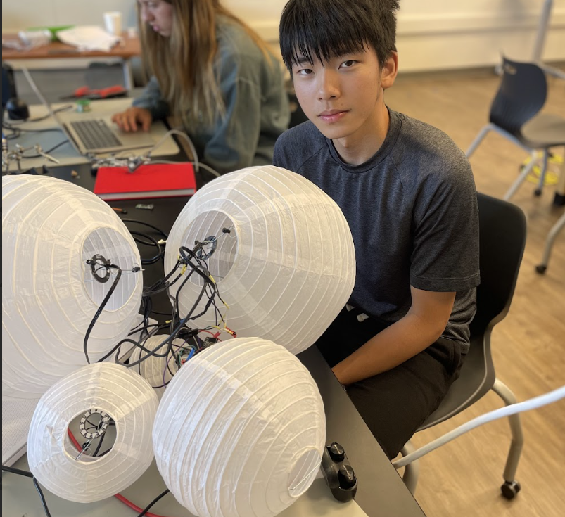
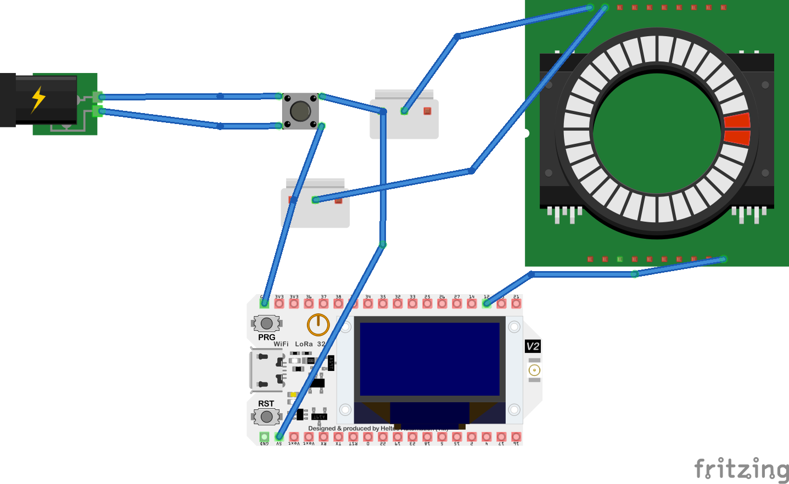

| **Engineer** | **School** | **Area of Interest** | **Grade** |
|:--:|:--:|:--:|:--:|
| Ryerson | Saint Andrews School (Delaware) | Material  | 10th grade 

# First Milestone

I chose the sound-reactive paper lantern to be my main project. This project functions on LED rings which are placed in the lanterns. The LED lights receive information from the microcontroller that was passed from the computer. They react to sound through a microphone on the computer, which is transcribed by the software. I planned to first assemble a prototype (Which is the first milestone). This prototype consists of simply a power supply, a switch, a microcontroller, and an LED ring. The power, when the switch is pressed, would pass onto the microcontroller and the LED ring at the same time, powering both. The commands would be sent from the software on the computer, which is received by the controller. The data is then transmitted through the data input wire to the LED ring, which controls the lighting pattern of the LED ring.

I have so far succeeded in applying the software, soldering three wires together, using a screw terminal, and connecting LEDs to the microcontroller. One challenge faced was the complicated schematic, which I hope will be solved in the future by drawing a more detailed schematic map. Also, this project requires precise soldering in many spots, which I am excited to learn more about and do better on. 

My next step is to desolder my prototype and move on to create a schematic with 7-8 LED rings wired, and make all of them reactive to music. 

##Schematic of the first milestone/prototype

<iframe width="560" height="315" src="https://www.youtube.com/embed/NpqBCa7kghs?si=nl133czFQXI5RgUp" title="YouTube video player" frameborder="0" allow="accelerometer; autoplay; clipboard-write; encrypted-media; gyroscope; picture-in-picture; web-share" referrerpolicy="strict-origin-when-cross-origin" allowfullscreen></iframe>

# Second Milestone
The second milestone of my project includes finishing building the structures of the lanterns (For instance, using expanders to expand the lanterns) and connecting all the wires. Similar to the prototype in milestone one, this system gains power from the power supply, which then powers the microcontroller and the 5 LED rings, one in each paper lantern. The add-ons from the previous model contain a “rail” which is built by three long cables, delivering the current from the switch to each LED ring. The three cables of the rail are power, ground and data. The Data cable is the odd one, it goes in and connects to the data input of a lantern, but it comes out from the data output, which is another joint. Because of this, data in this schematic does not work like others, it has an order, which is based on its sequence. The information would pass to the next only if the previous one functions.

So far, the lanterns are capable of lighting in an orangish yellow on their own, meaning that they do not require any command from the computer. However, if the microcontroller is connected to the computer, then the lanterns can create a light of any color, and with many types of frequencies and sequences. For instance, blue light for 1.5 seconds, then pause for 0.5 seconds, then light up red. Since the arrangement of the data wires creates an order, it is also possible for each lantern to have different colors at the same time, caused by the latency, or the delay of each LED ring because of the order. 

Challenges I faced during the building of the project centered around soldering. Soldering itself is not complicated, but the amount of joints that needed soldering deeply challenged my patience. Especially when some parts of a soldered joint fell off, which led to a collapse, with more time spent on fixing the issue. As I installed more LED rings , I became more skillful at soldering. I learned to spread the liquid metal out evenly before it solidifies, and measure the length and thickness of the heat shrinks to make sure that they fit the open spaces. 

The final step I need to complete in order to reach the third milestone is to make them all react to the sound input on my computer. This part would be done through LedFx, which is a web software that uses its algorithms to make the LED lights react to sound.

##Schematic of Second Milestone

<iframe width="560" height="315" src="https://www.youtube.com/embed/nVnFCNjOLyI?si=LCzvtY-z3W5bb2Oh" title="YouTube video player" frameborder="0" allow="accelerometer; autoplay; clipboard-write; encrypted-media; gyroscope; picture-in-picture; web-share" referrerpolicy="strict-origin-when-cross-origin" allowfullscreen></iframe>

# Final Milestone

During the time between my second and final milestone, I made my paper lanterns able to react to sounds. This is done through two software, WLED and LedFx. WLED is a web software, but it is also installed onto the microcontroller. WLED enables the LED rings to have different colors and rates, but it is not limited to doing so. The segment options allow the user to split the current LED rings into even smaller parts, and spacing will allow the user to have fewer LEDs on at the same time. Modifications such as adding a battery, sensors, or a timer are available for users of WLED, which makes the rings multipurpose, instead of just lighting up. LedFx is another software that can be considered as a user of WLED. It reads the audio input(sound) from the microphone on my computer and transcribes it into commands that first go to the microcontroller, and then to each of the LED rings. LedFx is what makes the lanterns sound reactive, it is based on WLED, which is why both software are needed. 

I also re-soldered almost all of the joints of my wires, because I realized that the male-to-male wires I was using were not strong enough to hold onto all five of my lanterns, which ripped them apart. My solution to this issue was to spread the liquid metal and cover the whole joint, which makes it look kind of like a cocoon. This strengthens the connections since the liquid metal would take on the weight of the body part, instead of the weak copper wires. What I learned from this experience is that the bigger the area that is soldered, the stronger the connection will be. Spreading the liquid metal out also eases the process of putting a heat shrink. If the liquid metal is not spread, it will tend to form the shape of a big raindrop. That requires a bigger heat shrink since the width of the point has been increased. However, heat shrinks stop shrinking at a certain size, a wider heat shrink means that it might not stick to the joint, and move around. 

The biggest challenge I faced during this milestone was working with LedFx. At first, the software was not working, because the lanterns were not reacting with the sounds. I thought of the issue as something relevant to my microphone, but after I tried all my possible inputs (15 of them), the problem still has not been fixed. Eventually, I reinstalled the device, LedFx, and WLED, which finally fixed the issue. Unfortunately, I was not able to figure out what was wrong exactly, so this happened several times. And each time I had to repeat the same process, a frustrating process.

After BSE, I would like to study more about physics. I would like to begin with the basics, such as force, light, and sound. Physics is one of the pillars of my dream career in material engineering. I would also like to learn more about the coding language C++. At BSE, I struggled with parts of my project that required coding knowledge, which made me believe that engineering and computer science are two subjects that stick together. I choose C++ because it is a widely used coding language, and also not too complicated to understand.

<iframe width="560" height="315" src="https://www.youtube.com/embed/dpp8-c5YHsA?si=QsAZN4PuagLgL-UV" title="YouTube video player" frameborder="0" allow="accelerometer; autoplay; clipboard-write; encrypted-media; gyroscope; picture-in-picture; web-share" referrerpolicy="strict-origin-when-cross-origin" allowfullscreen></iframe>

# Code
    
    void setup() {
      pinMode(ledPin, OUTPUT);
      pinMode(buttonPin, INPUT);
    
    void loop() {
      buttonState = digitalRead(buttonPin);
    
      if (buttonState == HIGH) {
        digitalWrite(ledPin, HIGH);
      } else {
        digitalWrite(ledPin, LOW);

# Bill of Materials
| Part                     | Note                                              | Price  | Link |
|:------------------------|:--------------------------------------------------|:-------|:-----|
| Arduino Board R3         | Provides a space and power converter for many inputs and outputs | $24.5  | [Link](https://www.amazon.com/Arduino-A000066-ARDUINO-UNO-R3/dp/B008GRTSV6/) |
| Adafruit ESP32 Feather V2 | Microcontroller of the main project               | $19.95 | [Link](https://www.adafruit.com/product/5400) |
| Neo Pixel Ring           | The output, the light                             | $7.5   | [Link](https://www.adafruit.com/product/1643) |
| Switch                   | Control the status of the lanterns                | $2.95  | [Link](https://www.adafruit.com/product/3064) |
| Female DC Power Adapter  | Adapt power from the ground power supply          | $2     | [Link](https://www.adafruit.com/product/368) |
| Power Supply             | Supply Power                                      | $7.95  | [Link](https://www.adafruit.com/product/276) |
| JST Connector            | Connect the electronics to the rail               | $1.5   | [Link](https://www.adafruit.com/product/1663) |
| Ribbon Cable             | Serving as wires                                  | $19.98 | [Link](https://www.amazon.com/dp/B07PMS4WNN?_encoding=UTF8&psc=1&ref_=cm_sw_r_cp_ud_dp_6S4PN0M8W63V88Q4RCYG_1) |
| Paper Lanterns           | Lanterns                                          | $17.99 | [Link](https://www.amazon.com/dp/B0757KS4L8?_encoding=UTF8&psc=1&ref_=cm_sw_r_cp_ud_dp_JMMSSZR94M6K803XZNP4) |

# Starter Project
My starter project is the Arduino Board with specific modifications to enable it to receive information from a button and light up the LED. I chose to install a button as my input and use the LED light on the board as my output because I believe that a button is the simplest input, and light is the most direct way to see an output. I chose this project because I thought it would be beneficial to produce a project that involves coding and circuits.
The 5V of the battery passing on from the board, travels to a rail which is connected to one of the legs of the button. When the button is pressed, the current passes through the button and then onto another wire which is connected to the digital pin 2 on the Arduino board. By doing so, the board would notice that the button is pressed, and the light would be turned on.
Another set of wires are ground, which are not charged, and what they do is provide a reference for the board in terms of the voltage difference.
This was quite a challenging project since I began with no knowledge of circuits and soldering, both topics cost me hours and hours. I am satisfied with what I learned and I hope I would do even more. 
<iframe width="560" height="315" src="https://www.youtube.com/embed/1ndPM6ghYaU?si=MM73s4r1F4oPDMNJ" title="YouTube video player" frameborder="0" allow="accelerometer; autoplay; clipboard-write; encrypted-media; gyroscope; picture-in-picture; web-share" referrerpolicy="strict-origin-when-cross-origin" allowfullscreen></iframe>
##Starter project schematic

